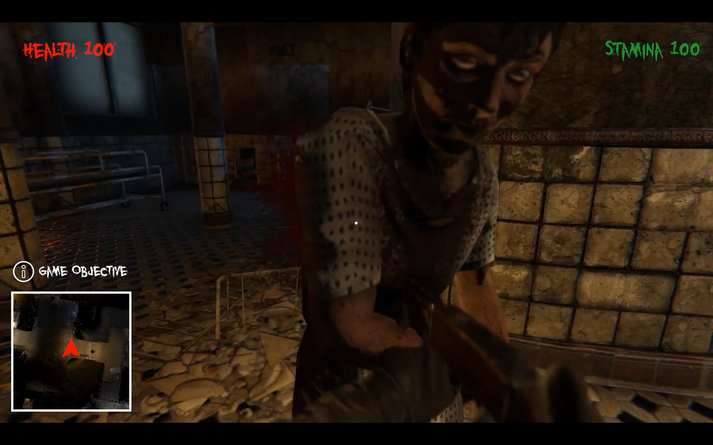
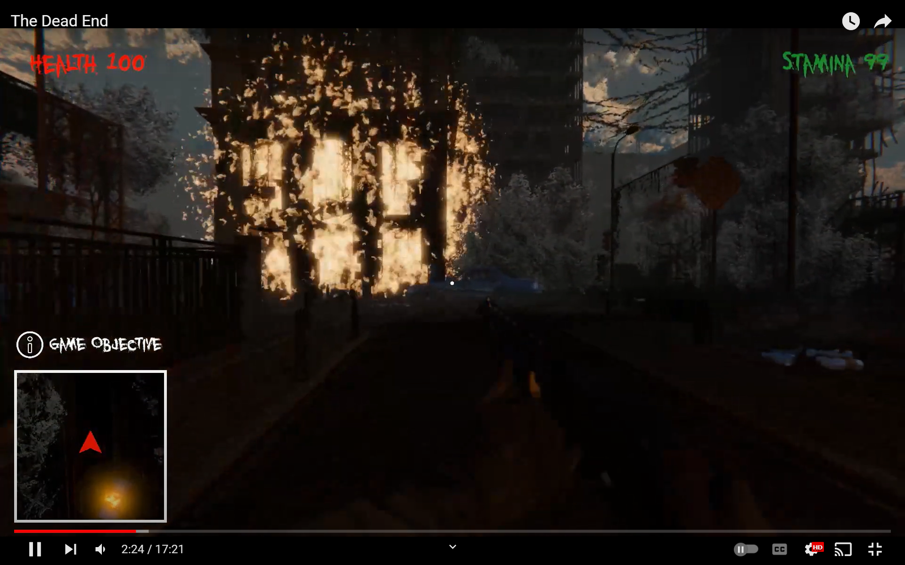
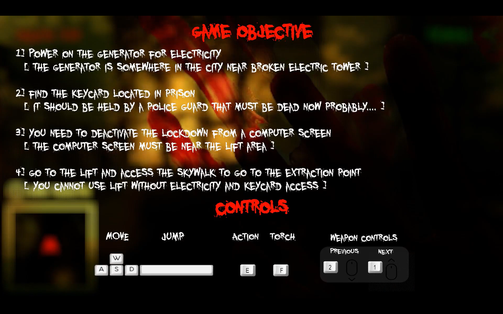
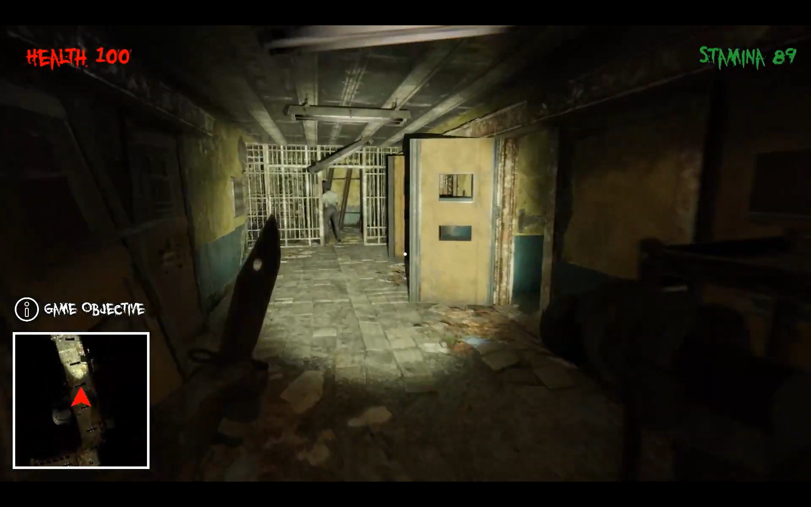

# The Dead End
Implemented ragdoll physics with a basic mission design. Enemies logic consists of AI navigation and AI States. Melee and Close-Ranged weapons use ray-casts to deal damage. Realism addition to the level design using fire and blood particle systems.

## Motivation
My final year diploma project on Unity of a small Horror-FPS. As a newbie game-dev, I showcased various basic and intermediate skills on C# and Unity engine core functions like NavMesh, 3D Audio, Animation Controllers, etc.

See the project in action here => https://www.youtube.com/watch?v=8pBceY97EoY

## Screenshots

## License
[MIT](https://choosealicense.com/licenses/mit/)
